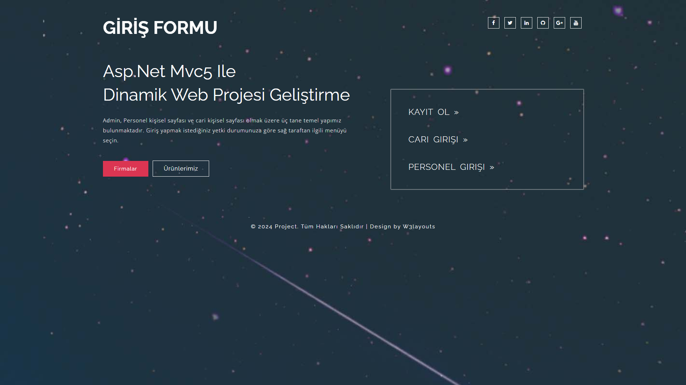
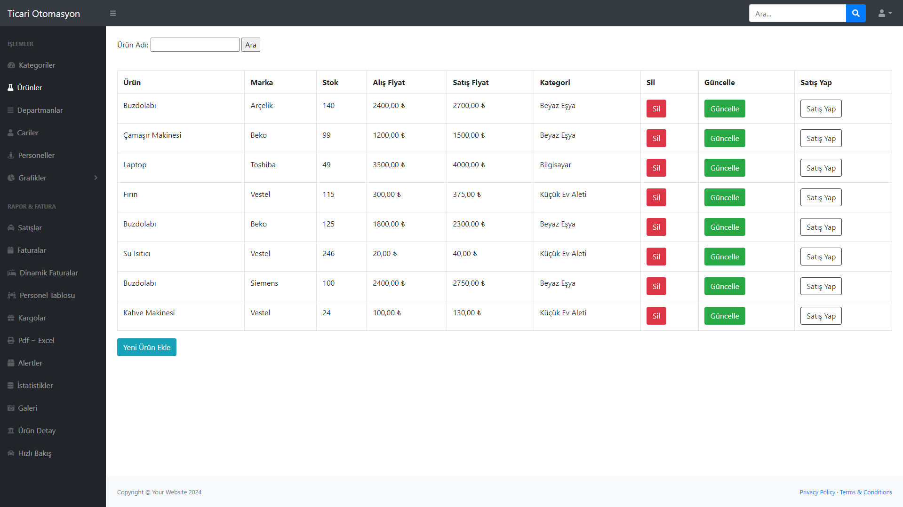
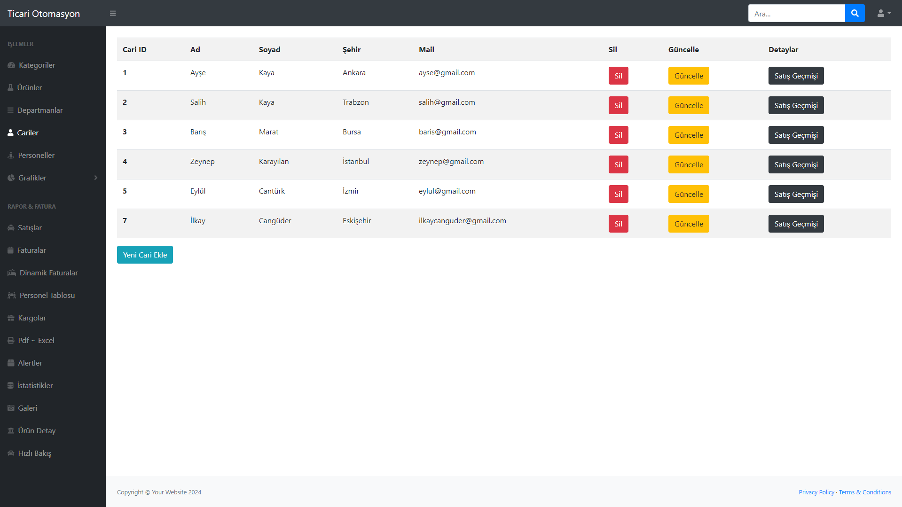
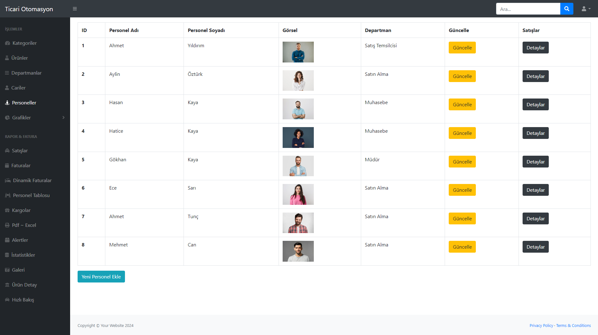
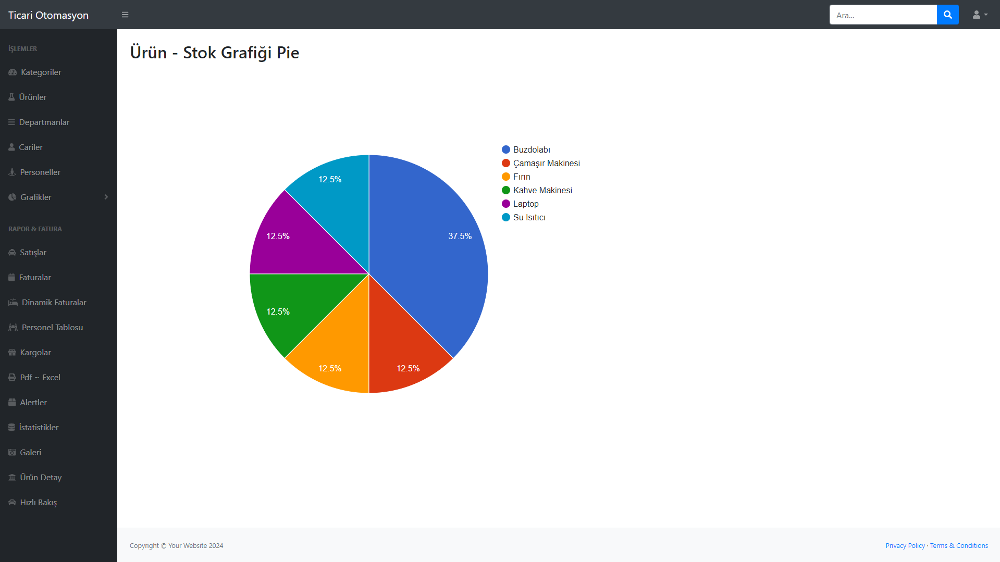
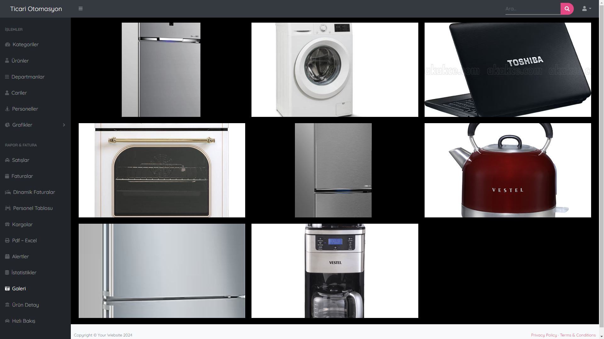

# MvcOnlineTicariOtomasyon

Bu proje, ticari bir otomasyon sistemini ASP.NET MVC ile yönetmek için kapsamlı bir uygulamadır. Ürün, müşteri ve satış takibi gibi temel özellikleri içerir.

Projede kullanılan veritabanı tabloları şunlardır:
- Admin
- Cariler
- Departman
- Detay
- FaturaKalem
- Faturalar
- Gider
- KargoDetay
- KargoTakip
- Kategori
- Personel
- SatışHareket
- Urun
- Yapılacak

## Ekran Görüntüleri










## Veritabanı Kurulumu

Veritabanını yüklemek için:

1. Proje dizininde yer alan `dataproje.bak` dosyasını kullanarak SQL Server'da bir veritabanı oluşturun.
   - SQL Server Management Studio (SSMS) açın.
   - Object Explorer'da "Databases" klasörüne sağ tıklayın.
   - "Restore Database" seçeneğini seçin.
   - `dataproje.bak` dosyasını seçip veritabanını geri yükleyin.

2. `web.config` dosyasındaki bağlantı ayarlarını kendi SQL Server yapılandırmanıza göre güncelleyin:

```xml
<connectionStrings>
    <add name="Context" 
         connectionString="Data Source=SUNUCU_ADINIZ;Initial Catalog=dataproje;Integrated Security=True" 
         providerName="System.Data.SqlClient" />
</connectionStrings>
```

3. Veritabanı yüklendikten ve bağlantı ayarları güncellendikten sonra projeyi çalıştırabilirsiniz.
